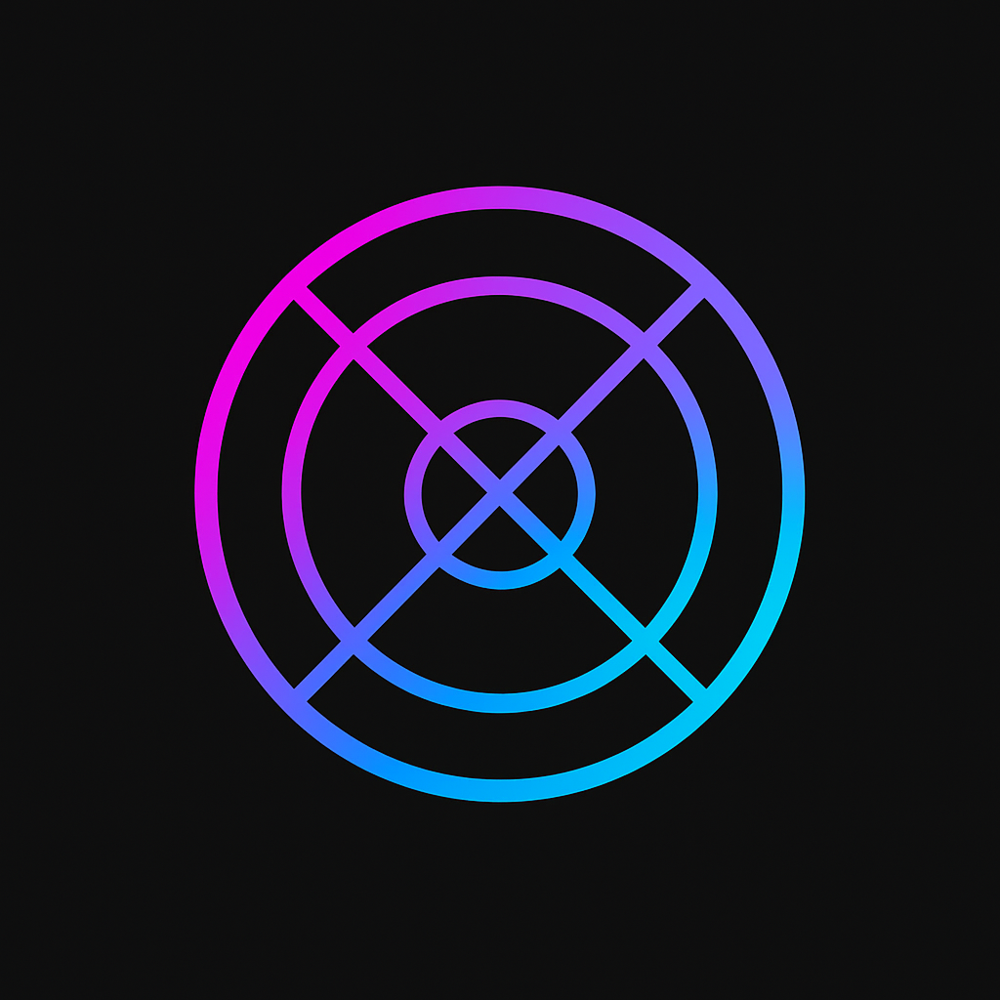

# TrackFlow 🎵

<div align="center">
  
  
  [](https://flutter.dev)
  [](https://firebase.google.com)
  [](LICENSE)
</div>

## Overview

TrackFlow is a modern, collaborative platform designed specifically for artists, producers, and songwriters to work together on music projects. Built with Flutter and Firebase, it provides a seamless experience across iOS and Android platforms.

## ✨ Features

- **Authentication**

<<<<<<< HEAD
  - Email/Password authentication
  - Google Sign-In integration
  - Secure user management

- **Project Collaboration**

  - Real-time project sharing
  - Team management
  - File sharing capabilities

- **Modern UI/UX**
  - Clean, intuitive interface
  - Responsive design
  - Platform-specific design elements

## 🛠 Technical Stack

- **Frontend**

  - Flutter SDK
  - BLoC pattern for state management
  - Go Router for navigation
  - Google Fonts for typography

- **Backend**
  - Firebase Authentication
  - Firebase Storage
  - Firebase Cloud Firestore

## 🏗 Architecture

TrackFlow follows clean architecture principles with a clear separation of concerns:

```
lib/
├── features/
│   ├── auth/
│   │   ├── data/
│   │   ├── domain/
│   │   └── presentation/
│   ├── home/
│   ├── onboarding/
│   ├── profile/
│   └── settings/
├── core/
│   ├── config/
│   ├── constants/
│   ├── data/
│   ├── models/
│   └── router/
└── main.dart
```

## 🚀 Getting Started

### Prerequisites

- Flutter SDK (^3.7.2)
- Dart SDK
- Firebase CLI
- iOS Simulator (for iOS development)
- Android Studio (for Android development)

### Installation

1. Clone the repository:

   ```bash
   git clone https://github.com/cristianmgm7/track_flow.git
   ```

2. Navigate to the project directory:

   ```bash
   cd track_flow
   ```

3. Install dependencies:

   ```bash
   flutter pub get
   ```

4. Configure Firebase:

   - Create a new Firebase project
   - Add your iOS and Android apps
   - Download and add the configuration files
   - Enable Authentication and Storage services

5. Run the app:
   ```bash
   flutter run
   ```

## 📱 Screenshots

<div align="center">
  
  <br>
  <em>Authentication Screen</em>
</div>

<div align="center">
  
  <br>
  <em>Dashboard View</em>
</div>

<div align="center">
  
  <br>
  <em>Project Collaboration</em>
</div>

## 🤝 Contributing

Contributions are welcome! Please feel free to submit a Pull Request.

1. Fork the repository
2. Create your feature branch (`git checkout -b feature/AmazingFeature`)
3. Commit your changes (`git commit -m 'Add some AmazingFeature'`)
4. Push to the branch (`git push origin feature/AmazingFeature`)
5. Open a Pull Request

## 📄 License

This project is licensed under the MIT License - see the [LICENSE](LICENSE) file for details.

## 👥 Authors

- Cristian Murillo - Initial work - [cristianmgm7](https://github.com/cristianmgm7)

## 🙏 Acknowledgments

- Flutter team for the amazing framework
- Firebase team for the backend services
- All contributors who have helped shape TrackFlow

---

<div align="center">
  Made with ❤️ by Cristian Murillo
</div>
=======
For help getting started with Flutter development, view the
[online documentation](https://docs.flutter.dev/), which offers tutorials,
samples, guidance on mobile development, and a full API reference.

## Clean Architecture Overview

This project uses Clean Architecture and Domain-Driven Design (DDD) principles for scalable, maintainable, and testable code.

### Layers

- **Presentation Layer:** Contains UI widgets and Blocs. Blocs only depend on use cases, not on repositories or data sources.
- **Domain Layer:** Contains business logic, use cases, and repository contracts. Use cases encapsulate all business rules and validation.
- **Data Layer:** Contains repository implementations, DTOs, and data sources (local and remote).

### Dependency Injection

- Uses [`get_it`](https://pub.dev/packages/get_it) for dependency injection.
- All use cases are grouped in a `ProjectUseCases` class and injected into Blocs via a service locator.

### User ID Handling

- The authenticated user ID is tracked in `ProjectsBloc` via a `BlocListener` on `AuthBloc`.
- All project operations use the correct user context, ensuring security and correct data access.

### Error Handling

- All errors are represented by subclasses of `Failure` (e.g., `ValidationFailure`, `DatabaseFailure`, `PermissionFailure`, etc.).
- The Bloc maps each failure type to a user-friendly message for the UI.

### Example Flow (Create Project)

1. **UI** dispatches a `CreateProject` event to `ProjectsBloc`.
2. **ProjectsBloc** calls the `CreateProjectUseCase` from the injected `ProjectUseCases` group.
3. **CreateProjectUseCase** validates the project using `ProjectModel` and calls the repository contract.
4. **SyncProjectRepository** implements the contract, using DTOs and data sources to persist the project.
5. **Data Sources** handle local (Hive) and remote (Firestore) storage.

---

## Next Steps

- Add more documentation as new features and improvements are made.
- See the code for detailed comments and structure.
>>>>>>> develop
