# TrackFlow 🎵

<div align="center">
  
  
  [](https://flutter.dev)
  [](https://firebase.google.com)
  [](https://blog.cleancoder.com/uncle-bob/2012/08/13/the-clean-architecture.html)
  [](https://bloclibrary.dev)
  [](https://github.com/features/actions)
  [](#-flavors)
  [](LICENSE)
</div>

## Overview

TrackFlow is a modern, collaborative audio platform built for music creators, producers, and audio professionals. Leveraging Domain-Driven Design (DDD) principles and Clean Architecture, it provides a robust, scalable solution for real-time audio collaboration across iOS, Android, and desktop platforms.

**🎉 Ready for Production:** Complete CI/CD pipeline with GitHub Actions, 3-environment setup (dev/staging/prod), Firebase integration, and automated distribution to testers.

### 🎯 **Core Mission**

Empowering music creators to collaborate seamlessly through advanced audio features, real-time feedback systems, and permission-based project management, while maintaining professional-grade audio quality and workflow efficiency.

## ✨ Features

### 🔐 **Advanced Authentication & Security**

- Multi-provider authentication (Email/Password, Google Sign-In)
- Role-based access control (RBAC) with granular permissions
- Active domain security patterns for project isolation
- Firebase Authentication with secure session management

### 🎵 **Professional Audio Collaboration**

- **Real-time Audio Processing**: High-quality recording and playback
- **Audio Waveform Visualization**: Interactive audio timeline with visual feedback
- **Time-stamped Comments**: Precise feedback system on specific audio segments
- **Background Audio Service**: Continuous playback with system integration
- **Multi-format Support**: Comprehensive audio file handling

### 👥 **Smart Project Management**

- **Permission-based Collaboration**: Owner, Admin, Editor, Viewer roles
- **Real-time Sync**: Live project updates across all devices
- **Magic Link Sharing**: Secure project invitations via Firebase Dynamic Links
- **Offline-first Architecture**: Local caching with automatic sync
- **Creative Role Tracking**: Producer, songwriter, mixing engineer profiles

### 🏗️ **Enterprise-Grade Architecture**

- **Domain-Driven Design**: Rich domain models with business logic encapsulation
- **Clean Architecture**: Clear separation of concerns across layers
- **Functional Error Handling**: Type-safe error propagation with Either monads
- **Event-driven Design**: Reactive state management with BLoC pattern
- **Comprehensive Testing**: Unit, integration, and mock testing coverage

## 🛠 Technical Stack

### **Core Framework & Language**

- **Flutter SDK** ^3.7.2 - Cross-platform development framework
- **Dart** ^3.7.2 - Primary programming language

### **Architecture & Design Patterns**

- **Domain-Driven Design (DDD)** - Rich domain modeling with ubiquitous language
- **Clean Architecture** - Layered architecture with dependency inversion
- **BLoC Pattern** - Reactive state management with business logic separation
- **Repository Pattern** - Data access abstraction with dependency injection
- **Active Domain Model** - Domain entities with embedded business logic

### **State Management & Reactive Programming**

- **flutter_bloc** ^8.1.4 - BLoC state management implementation
- **rxdart** ^0.28.0 - Reactive extensions for Dart streams
- **equatable** ^2.0.5 - Value equality for immutable objects

### **Backend Services (Firebase)**

- **Firebase Core** ^3.13.0 - Firebase SDK foundation
- **Firebase Auth** ^5.5.3 - Authentication & user management
- **Cloud Firestore** ^5.6.7 - NoSQL document database with real-time sync
- **Firebase Storage** ^12.4.5 - Cloud file storage for audio assets
- **Firebase Dynamic Links** ^6.1.5 - Deep linking for project sharing

### **Audio Processing & Media**

- **just_audio** ^0.10.4 - Professional audio playback engine
- **audio_session** ^0.1.16 - Audio session management
- **audio_service** ^0.18.10 - Background audio processing
- **record** ^5.0.0 - High-quality audio recording
- **audio_waveforms** ^1.3.0 - Real-time waveform visualization

### **Local Storage & Caching**

- **Isar Database** ^3.1.0+1 - High-performance NoSQL local database
- **SharedPreferences** ^2.2.2 - Key-value storage for user preferences
- **Path Provider** ^2.1.2 - File system path management

### **Dependency Injection & Code Generation**

- **get_it** ^8.0.3 - Service locator pattern implementation
- **injectable** ^2.1.2 - Dependency injection with code generation
- **build_runner** ^2.4.8 - Dart code generation tool

### **Functional Programming & Error Handling**

- **dartz** ^0.10.1 - Functional programming utilities (Either, Option monads)
- **Failure Types** - Custom error hierarchy with domain-specific failures

### **Testing & Quality Assurance**

- **flutter_test** - Unit testing framework
- **bloc_test** ^9.1.6 - BLoC testing utilities
- **mockito** ^5.4.4 - Mock object generation for testing
- **fake_cloud_firestore** ^3.1.0 - Firebase testing utilities

### **UI/UX & Navigation**

- **go_router** ^13.2.0 - Declarative routing with type safety
- **google_fonts** ^6.1.0 - Typography system
- **flutter_slidable** ^3.0.0 - Interactive list components
- **introduction_screen** ^3.1.12 - Onboarding flow

## 🏗 Architecture

TrackFlow implements **Domain-Driven Design (DDD)** with **Clean Architecture** principles, creating a highly maintainable and scalable codebase that accurately models the audio collaboration domain.

### **📐 Clean Architecture Layers**

```mermaid
graph TB
    UI[🎨 Presentation Layer] --> APP[📋 Application Layer]
    APP --> DOMAIN[🏛️ Domain Layer]
    APP --> DATA[💾 Data Layer]
    DATA --> EXT[🌐 External Layer]

    UI -.-> |"BLoC Events"| APP
    APP -.-> |"BLoC States"| UI
    DOMAIN -.-> |"Repository Contracts"| DATA
    DATA -.-> |"Firebase/Isar"| EXT
```



### **🏛️ Domain-Driven Design Implementation**

#### **Rich Domain Models with Business Logic**

```dart
// Domain Entity with Embedded Business Logic
class Project extends AggregateRoot<ProjectId> {
  final ProjectName name;
  final UserId ownerId;
  final List<ProjectCollaborator> collaborators;

  // Domain methods enforce business rules
  Project addCollaborator({
    required UserId requester,
    required UserId newCollaboratorId,
    required ProjectRole role,
  }) {
    final requesterCollaborator = _findCollaborator(requester);

    if (!requesterCollaborator.hasPermission(ProjectPermission.addCollaborator)) {
      throw ProjectPermissionException();
    }

    // Business logic implementation...
  }
}
```

#### **Active Domain Patterns for Permission Management**

```dart
// Permission-based Active Domain Model
class ProjectCollaborator extends Entity<ProjectCollaboratorId> {
  final UserId userId;
  final ProjectRole role;
  final List<ProjectPermission> specificPermissions;

  // Domain logic for permission checking
  bool hasPermission(ProjectPermission permission) {
    if (specificPermissions.contains(permission)) return true;

    switch (role.value) {
      case ProjectRoleType.owner:
        return true; // Full access
      case ProjectRoleType.admin:
        return _adminPermissions.contains(permission);
      case ProjectRoleType.editor:
        return _editorPermissions.contains(permission);
      case ProjectRoleType.viewer:
        return false; // Read-only access
    }
  }
}
```

### **📁 Project Structure (Clean Architecture + DDD)**

```
lib/
├── 🏛️ core/                          # Shared kernel
│   ├── di/                           # Dependency injection
│   ├── domain/                       # Base domain classes
│   │   ├── entity.dart              # Base entity
│   │   ├── aggregate_root.dart      # DDD aggregate root
│   │   └── value_object.dart        # Value object base
│   ├── error/                        # Error handling
│   │   ├── failures.dart           # Failure hierarchy
│   │   └── exceptions.dart          # Domain exceptions
│   └── utils/                        # Shared utilities
│
├── 🎵 features/                      # Bounded contexts
│   ├── 🔐 auth/                     # Authentication context
│   │   ├── domain/
│   │   │   ├── entities/           # User aggregate
│   │   │   ├── repositories/       # Repository contracts
│   │   │   ├── usecases/           # Application services
│   │   │   └── value_objects/      # Email, Password
│   │   ├── data/
│   │   │   ├── datasources/        # Firebase Auth, Local storage
│   │   │   ├── dto/                # Data transfer objects
│   │   │   └── repositories/       # Repository implementations
│   │   └── presentation/
│   │       ├── blocs/              # BLoC state management
│   │       ├── pages/              # UI screens
│   │       └── widgets/            # Reusable components
│   │
│   ├── 🎼 projects/                 # Project collaboration context
│   │   ├── domain/
│   │   │   ├── entities/
│   │   │   │   ├── project.dart           # Project aggregate root
│   │   │   │   └── project_collaborator.dart
│   │   │   ├── value_objects/
│   │   │   │   ├── project_name.dart     # Value objects with validation
│   │   │   │   ├── project_role.dart     # Role-based permissions
│   │   │   │   └── project_permission.dart
│   │   │   ├── services/                 # Domain services
│   │   │   ├── exceptions/               # Project-specific exceptions
│   │   │   └── usecases/                # Business use cases
│   │   ├── data/                        # Data access layer
│   │   └── presentation/                # UI layer
│   │
│   ├── 🎵 audio_track/              # Audio management context
│   ├── 💬 audio_comment/            # Feedback system context
│   ├── 👥 user_profile/             # User management context
│   ├── 🔗 magic_link/               # Sharing context
│   └── 📱 manage_collaborators/     # Team management context
│
└── main.dart                        # Application entry point
```

### **🔄 Data Flow Architecture**

#### **Command Flow (Write Operations)**

```mermaid
sequenceDiagram
    participant UI as 🎨 UI Widget
    participant Bloc as 📋 BLoC
    participant UseCase as 🏛️ Use Case
    participant Repo as 📊 Repository
    participant DS as 💾 Data Source
    participant FB as 🔥 Firebase

    UI->>Bloc: Dispatch Event
    Bloc->>UseCase: Execute Business Logic
    UseCase->>Repo: Call Repository Contract
    Repo->>DS: Remote Data Source
    DS->>FB: Firebase Operation
    FB-->>DS: Response
    DS-->>Repo: Either<Failure, T>
    Repo-->>UseCase: Domain Entity
    UseCase-->>Bloc: Business Result
    Bloc-->>UI: Emit State
```



#### **Query Flow (Read Operations)**

```mermaid
sequenceDiagram
    participant UI as 🎨 UI Widget
    participant Bloc as 📋 BLoC
    participant UseCase as 🏛️ Use Case
    participant Repo as 📊 Repository
    participant Local as 💽 Local Cache
    participant Remote as 🌐 Remote Source

    UI->>Bloc: Request Data
    Bloc->>UseCase: Get Data
    UseCase->>Repo: Query Repository

    Repo->>Local: Check Local Cache (Isar)
    Local-->>Repo: Cached Data

    alt Cache Miss or Stale
        Repo->>Remote: Fetch Remote Data
        Remote-->>Repo: Fresh Data
        Repo->>Local: Update Cache
    end

    Repo-->>UseCase: Domain Entity
    UseCase-->>Bloc: Result
    Bloc-->>UI: Update State
```



## 🎭 **Flavors (Environments)**

TrackFlow is configured with **3 professional environments**:

| Environment        | Package ID              | Firebase Project    | Usage                         |
| ------------------ | ----------------------- | ------------------- | ----------------------------- |
| 🏠 **Development** | `com.trackflow.dev`     | `trackflow-dev`     | Local development & debugging |
| 🧪 **Staging**     | `com.trackflow.staging` | `trackflow-staging` | Beta testing with testers     |
| 🚀 **Production**  | `com.trackflow`         | `trackflow-prod`    | Live users in app stores      |

### **Running Different Flavors:**

```bash
# Development (with full logging)
./scripts/run_flavors.sh development debug

# Staging (for beta testers)
./scripts/run_flavors.sh staging debug

# Production (no logs, store-ready)
./scripts/run_flavors.sh production release
```

---

## 🤖 **CI/CD Pipeline**

**Automated GitHub Actions workflows:**

- 🧪 **CI:** Tests & code analysis on every push/PR
- 🔨 **Debug Builds:** Automatic APK distribution to testers on develop
- 🚀 **Release Builds:** Production-ready builds on version tags
- 📱 **Firebase Distribution:** Manual distribution to specific tester groups

**Workflow:** `Push to develop` → `Automatic build` → `Testers notified` → `Download & test`

---

## 🚀 Getting Started

### Prerequisites

- Flutter SDK (^3.24.3)
- Dart SDK
- Firebase CLI
- iOS Simulator (for iOS development)
- Android Studio (for Android development)

### **📚 Complete Setup Guide**

> **👉 For complete setup instructions, see [`docs/`](docs/) folder with comprehensive guides:**

- 📋 **[Complete Overview](docs/RESUMEN_COMPLETO.md)** - Full project context
- ⚡ **[Quick Commands](docs/COMANDOS_RAPIDOS.md)** - Daily development commands
- 🤖 **[Automated Workflow](docs/WORKFLOW_AUTOMATIZADO.md)** - How automation works
- 🔥 **[Firebase Setup](docs/development/FIREBASE_PASO_A_PASO.md)** - Step-by-step Firebase config
- ⚙️ **[GitHub Actions](docs/workflows/GUIA_GITHUB_ACTIONS.md)** - CI/CD configuration
- 🏪 **[Store Publishing](docs/distribution/GUIA_TIENDAS_APLICACIONES.md)** - App store deployment

### **Quick Start:**

1. **Clone and setup:**

   ```bash
   git clone https://github.com/cristianmgm7/track_flow.git
   cd trackflow
   flutter pub get
   ```

2. **Generate code:**

   ```bash
   flutter packages pub run build_runner build --delete-conflicting-outputs
   ```

3. **Run development flavor:**

   ```bash
   ./scripts/run_flavors.sh development debug
   ```

4. **For complete Firebase setup and production deployment:**
   📖 **See [docs/README.md](docs/README.md)** for detailed guides

## 📱 Screenshots

<div align="center">
  
  <br>
  <em>Authentication Screen</em>
</div>

<div align="center">
  
  <br>
  <em>Dashboard View</em>
</div>

<div align="center">
  
  <br>
  <em>Project Collaboration</em>
</div>

## 🤝 Contributing

Contributions are welcome! Please feel free to submit a Pull Request.

1. Fork the repository
2. Create your feature branch (`git checkout -b feature/AmazingFeature`)
3. Commit your changes (`git commit -m 'Add some AmazingFeature'`)
4. Push to the branch (`git push origin feature/AmazingFeature`)
5. Open a Pull Request

## 📄 License

This project is licensed under the MIT License - see the [LICENSE](LICENSE) file for details.

## 👥 Authors

- Cristian Murillo - Initial work - [cristianmgm7](https://github.com/cristianmgm7)

## 🙏 Acknowledgments

- Flutter team for the amazing framework
- Firebase team for the backend services
- All contributors who have helped shape TrackFlow

---

<div align="center">
  Made with ❤️ by Cristian Murillo
</div>

For help getting started with Flutter development, view the
[online documentation](https://docs.flutter.dev/), which offers tutorials,
samples, guidance on mobile development, and a full API reference.

### **🔐 Permission Management & Active Domain**

TrackFlow implements sophisticated **Active Domain Patterns** for permission management, where domain entities encapsulate not just data but also the business rules that govern access control.

#### **Role-Based Access Control (RBAC)**

```dart
enum ProjectPermission {
  editProject, deleteProject, addCollaborator, removeCollaborator,
  updateCollaboratorRole, addTrack, editTrack, deleteTrack,
  addComment, editComment, deleteComment, viewProject, playTrack
}

enum ProjectRoleType {
  owner,    // Full access to all project operations
  admin,    // Can manage collaborators and project settings
  editor,   // Can edit tracks and add comments
  viewer    // Read-only access
}
```

#### **Domain-Driven Permission Enforcement**

The permission system is embedded directly in the domain entities, ensuring business rules are enforced at the domain level rather than in the UI or application layer:

```dart
// Permission checking happens in domain entities
Project updateProject({required UserId requester, ProjectName? newName}) {
  final collaborator = collaborators.firstWhere(
    (c) => c.userId == requester,
    orElse: () => throw UserNotCollaboratorException(),
  );

  if (!collaborator.hasPermission(ProjectPermission.editProject)) {
    throw ProjectPermissionException('User lacks edit permissions');
  }

  return copyWith(name: newName, updatedAt: DateTime.now());
}
```

### **🛡️ Security Architecture**

#### **Domain-Level Security**

- **Entity-Based Access Control**: Permissions are checked within domain entities
- **Aggregate Boundaries**: Security rules are enforced at aggregate roots
- **Domain Exceptions**: Security violations throw domain-specific exceptions
- **Type-Safe IDs**: Strongly-typed identifiers prevent ID confusion

#### **Infrastructure Security**

- **Firebase Security Rules**: Server-side validation of permissions
- **Authentication States**: Reactive authentication state management
- **Session Management**: Secure user session handling with automatic renewal

### **📊 Error Handling Strategy**

#### **Functional Error Handling with Either Monads**

```dart
// Repository returns Either<Failure, Success> for type-safe error handling
Future<Either<Failure, Project>> createProject(Project project) async {
  try {
    final result = await remoteDataSource.createProject(project);
    return result.fold(
      (failure) => Left(failure),
      (project) async {
        await localDataSource.cacheProject(project);
        return Right(project);
      },
    );
  } catch (e) {
    return Left(UnexpectedFailure(e.toString()));
  }
}
```

#### **Domain-Specific Failure Types**

```dart
abstract class Failure extends Equatable {
  final String message;
  const Failure(this.message);
}

// Specific failure types for different domains
class ProjectPermissionFailure extends Failure { /* ... */ }
class NetworkFailure extends Failure { /* ... */ }
class ValidationFailure extends Failure { /* ... */ }
class AuthenticationFailure extends Failure { /* ... */ }
```

### **🔄 Real-time Collaboration Architecture**

#### **Event-Driven Real-time Updates**

- **Firestore Streams**: Real-time document synchronization
- **Local Cache First**: Offline-first with automatic sync
- **Conflict Resolution**: Last-write-wins with user notification
- **Optimistic Updates**: Immediate UI feedback with rollback capability

#### **Collaborative Features Implementation**

- **Real-time Project Updates**: Live collaboration on project changes
- **Time-stamped Comments**: Precise feedback on audio segments
- **Permission-aware UI**: Dynamic UI based on user permissions
- **Offline Collaboration**: Local changes sync when connection restored

---

## 📋 Development Best Practices

### **Domain-Driven Design Principles**

1. **Ubiquitous Language**: Consistent terminology across codebase and domain
2. **Bounded Contexts**: Clear feature boundaries with minimal coupling
3. **Rich Domain Models**: Business logic embedded in domain entities
4. **Aggregate Design**: Proper encapsulation of business rules
5. **Domain Services**: Complex operations that don't belong to single entities

### **Clean Architecture Guidelines**

1. **Dependency Inversion**: Domain layer independent of external concerns
2. **Single Responsibility**: Each layer has distinct responsibilities
3. **Interface Segregation**: Small, focused repository interfaces
4. **Dependency Injection**: Loose coupling through service locator pattern

### **Code Quality Standards**

- **Type Safety**: Extensive use of value objects and strong typing
- **Immutability**: Immutable domain entities with copy methods
- **Error Handling**: Comprehensive error handling with Either types
- **Testing**: Unit tests for all domain logic and use cases
- **Documentation**: Self-documenting code with clear naming conventions

---

## 🚀 Getting Started

### **Quick Start Guide**

1. **Clone and Setup**

```bash
git clone https://github.com/cristianmgm7/track_flow.git
cd trackflow
flutter pub get
```

2. **Generate Code**

```bash
flutter packages pub run build_runner build --delete-conflicting-outputs
```

3. **Firebase Configuration**

- Create Firebase project at [Firebase Console](https://console.firebase.google.com)
- Enable Authentication, Firestore, and Storage
- Download configuration files (`google-services.json`, `GoogleService-Info.plist`)
- Add files to respective platform directories

4. **Run Application**

```bash
flutter run
```

### **Development Workflow**

#### **Adding New Features**

Follow the established patterns documented in `.claude/commands/datasource_best_practices.md`:

```bash
# Use the automation command for new features
@datasource_best_practices.md Create a [feature_name] feature with [requirements]
```

#### **Code Generation Commands**

```bash
# Dependency injection
flutter packages pub run build_runner build

# Database models
flutter packages pub run build_runner build --delete-conflicting-outputs

# Clean previous builds
flutter packages pub run build_runner clean
```

#### **Testing Strategy**

```bash
# Unit tests
flutter test

# Integration tests
flutter test integration_test/

# Widget tests
flutter test test/widget_test.dart
```

---

## 📖 Additional Resources

- **[Data Source Best Practices](.claude/commands/datasource_best_practices.md)** - Comprehensive guide for implementing new features
- **[Feature Creation Automation](.claude/commands/create_feature.md)** - Templates and automation for rapid development
- **Domain Documentation** - In-code documentation for domain models and business rules
- **API Documentation** - Firebase integration patterns and best practices
# Testing Codemagic build
