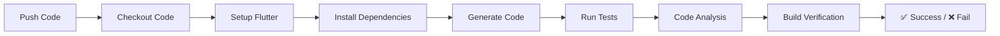
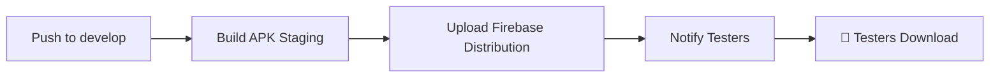
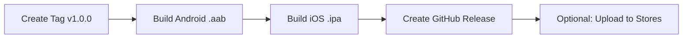
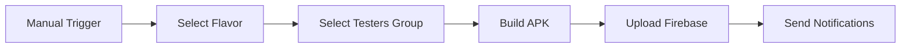

# 🤖 TrackFlow - Workflow Automatizado Completo

Esta es tu guía visual y práctica de cómo funciona todo el sistema de automatización que configuramos.

---

## 🎯 **RESUMEN VISUAL DEL FLUJO**

```
💻 DESARROLLO LOCAL
    ↓ (git push)
🧪 GITHUB ACTIONS - CI
    ↓ (merge develop)  
📱 BUILD AUTOMÁTICO - STAGING
    ↓ (Firebase App Distribution)
👥 TESTERS RECIBEN APK
    ↓ (git tag v1.0.0)
🚀 BUILD AUTOMÁTICO - PRODUCTION
    ↓ (manual)
🏪 SUBIDA A TIENDAS
```

---

## 🔄 **FLUJOS AUTOMÁTICOS CONFIGURADOS**

### 1. **🧪 CI - VALIDACIÓN CONTINUA** 
**Trigger:** Push a cualquier branch, Pull Requests



**¿Qué hace?**
- ✅ Ejecuta todos los tests unitarios
- 🔍 Análisis de código con `flutter analyze`
- 📊 Genera coverage report
- 🔒 Security scanning
- 🔨 Verifica que compile en todos los flavors

**¿Cuándo se ejecuta?**
```bash
# Automáticamente en:
git push origin feature/mi-feature
git push origin develop  
git push origin main

# También en PRs:
# GitHub.com → Create Pull Request → ✅ Automático
```

---

### 2. **🔨 BUILD DEBUG - DESARROLLO** 
**Trigger:** Push a `develop`, Manual



**¿Qué hace?**
- 🔨 Genera APK de staging automáticamente
- 📱 Sube a Firebase App Distribution
- 🔔 Notifica a testers vía Slack/Email
- 📦 Guarda APK como artifact en GitHub

**¿Cuándo se ejecuta?**
```bash
# Automático:
git checkout develop
git merge feature/mi-feature
git push origin develop
# → 📱 Testers reciben notificación automática

# Manual:
# GitHub.com → Actions → "🔨 Build Debug APKs" → Run workflow
```

---

### 3. **🚀 BUILD RELEASE - PRODUCCIÓN**
**Trigger:** Tags (`v1.0.0`), Manual



**¿Qué hace?**
- 🤖 Build Android App Bundle (.aab) firmado para Google Play
- 🍎 Build iOS Archive (.ipa) firmado para App Store
- 🏷️ Crea GitHub Release automáticamente
- 📦 Adjunta archivos (.aab/.ipa) al release
- 🏪 [Opcional] Sube automáticamente a las tiendas

**¿Cuándo se ejecuta?**
```bash
# Automático con tags:
git tag v1.0.0
git push origin v1.0.0
# → 🤖 Build completo automático

# Manual:
# GitHub.com → Actions → "🚀 Build Release" → Run workflow
```

---

### 4. **📱 DEPLOY FIREBASE - DISTRIBUCIÓN**
**Trigger:** Manual (tú decides cuándo)



**¿Qué hace?**
- 🎯 Builds específicos por flavor (development/staging)
- 👥 Distribución a grupos específicos de testers
- 📧 Notificaciones personalizadas
- 🍎 [Opcional] Build iOS para TestFlight

**¿Cuándo se ejecuta?**
```bash
# Solo manual:
# GitHub.com → Actions → "📱 Deploy Firebase" → Run workflow
# Seleccionas: Flavor, Grupo de testers, Notas del release
```

---

## 🎮 **CÓMO USAR EL SISTEMA**

### **Desarrollo Diario (Automático):**

1. **Desarrollas tu feature:**
```bash
git checkout -b feature/nueva-funcionalidad
# Desarrollas con hot reload local
./scripts/run_flavors.sh development debug
```

2. **Push para validación:**
```bash
git push origin feature/nueva-funcionalidad
# ✅ GitHub Actions ejecuta CI automáticamente
# ✅ Verifica tests, análisis, builds
```

3. **Crear PR:**
```bash
# GitHub.com → Create Pull Request
# ✅ GitHub Actions valida tu PR automáticamente
# ✅ Solo se puede mergear si pasa todas las validaciones
```

4. **Merge a develop:**
```bash
git checkout develop  
git merge feature/nueva-funcionalidad
git push origin develop
# 🤖 GitHub Actions automáticamente:
#   - Hace build de staging
#   - Sube a Firebase App Distribution  
#   - Notifica a testers
#   - Testers pueden descargar inmediatamente
```

---

### **Release de Producción (Semi-automático):**

1. **Preparar release:**
```bash
# Todo listo en develop, hacer merge a main
git checkout main
git merge develop
```

2. **Crear tag de versión:**
```bash
git tag v1.0.0
git push origin main --tags
# 🚀 GitHub Actions automáticamente:
#   - Ejecuta todos los tests
#   - Genera .aab para Google Play Store  
#   - Genera .ipa para App Store
#   - Crea GitHub Release con archivos adjuntos
```

3. **Subir a tiendas (manual):**
```bash
# Descargar archivos del GitHub Release:
# - trackflow-production-release-aab-v1.0.0.aab
# - trackflow-production-release-ipa-v1.0.0.ipa

# Subir manualmente a:
# - Google Play Console
# - App Store Connect
```

---

### **Testing con Beta Testers (Manual cuando quieras):**

1. **Trigger manual:**
```bash
# GitHub.com → Actions → "📱 Deploy Firebase App Distribution"
# → Run workflow
```

2. **Configurar distribución:**
```yaml
Flavor: staging                    # o development
Release notes: "Nueva funcionalidad X añadida"  
Testers group: qa-team            # o beta-testers
```

3. **Resultado automático:**
```bash
# GitHub Actions:
# ✅ Hace build del flavor seleccionado
# ✅ Sube a Firebase App Distribution
# ✅ Envía notificaciones a Slack
# ✅ [Opcional] Envía emails a beta testers
# 📱 Testers reciben notificación y pueden descargar
```

---

## 📊 **MONITOREO Y FEEDBACK**

### **Dashboard de GitHub Actions:**
```
GitHub.com → Tu Repo → Actions

Verás:
🧪 CI - Tests y Análisis        ✅ Passing
🔨 Build Debug APKs            ✅ Success  
🚀 Build Release - Production   🔄 Running
📱 Deploy Firebase             ⏸️ Waiting
```

### **Notificaciones Automáticas:**
- 🔔 **Slack:** Éxito/fallo de builds
- 📧 **Email:** Nueva versión disponible para testers
- 📱 **Firebase App Distribution:** Push notification a testers

### **Artifacts Disponibles:**
```
GitHub.com → Tu Repo → Actions → [Workflow específico]

Descargas disponibles:
📦 trackflow-staging-debug-apk
📦 trackflow-production-release-aab-v1.0.0  
📦 trackflow-production-release-ipa-v1.0.0
```

---

## 🎛️ **CONFIGURACIÓN DE SECRETS (Solo una vez)**

Para que todo funcione automáticamente, necesitas configurar estos secrets en GitHub:

### **Ir a:** `GitHub.com → Tu Repo → Settings → Secrets and variables → Actions`

### **Firebase:**
```
FIREBASE_SERVICE_ACCOUNT         # JSON del service account
FIREBASE_APP_ID_DEV             # 1:664691871365:android:7ba3bcfca58beafeeca3ec
FIREBASE_APP_ID_STAGING         # Tu staging app ID
FIREBASE_APP_ID_PROD            # Tu production app ID
```

### **Android:**
```
ANDROID_KEYSTORE_BASE64         # Tu keystore en base64
ANDROID_KEYSTORE_PASSWORD       # Password del keystore
ANDROID_KEY_PASSWORD            # Password de la key
ANDROID_KEY_ALIAS              # trackflow-key-alias
```

### **Notificaciones (Opcional):**
```
SLACK_WEBHOOK_URL              # Para notificaciones de Slack
GMAIL_USERNAME                 # Para enviar emails a testers
GMAIL_PASSWORD                 # App password de Gmail
```

---

## 🚨 **TROUBLESHOOTING**

### **Build falla en GitHub Actions:**
```bash
# 1. Ver logs detallados:
GitHub.com → Actions → [Workflow que falló] → [Job que falló]

# 2. Errores comunes:
❌ "Secret not found" → Configurar secret en GitHub
❌ "Flutter analyze failed" → Arreglar issues en código local
❌ "Tests failed" → Arreglar tests que fallan
❌ "Firebase token invalid" → Regenerar service account
```

### **Testers no reciben notificación:**
```bash
# 1. Verificar en Firebase Console:
Firebase Console → App Distribution → Releases
# Debe aparecer tu release

# 2. Verificar grupos de testers:
Firebase Console → App Distribution → Testers & Groups
# Verificar que el grupo existe y tiene testers

# 3. Re-enviar invitaciones:
Firebase Console → [Tu release] → Resend invitations
```

### **APK no instala en testers:**
```bash
# Verificar que el package name coincida:
Firebase Console → Project Settings → Your apps
# vs
android/app/build.gradle.kts → applicationId

# Deben ser iguales para cada flavor
```

---

## 📈 **MÉTRICAS Y OPTIMIZACIÓN**

### **Tiempos de Build Típicos:**
- 🧪 **CI (Tests):** 3-5 minutos
- 🔨 **Debug Build:** 5-8 minutos  
- 🚀 **Release Build:** 8-12 minutos
- 📱 **Firebase Deploy:** 3-5 minutos

### **Optimizaciones Disponibles:**
```yaml
# Cache más agresivo:
- uses: actions/cache@v4
  with:
    path: ~/.gradle/caches
    key: ${{ runner.os }}-gradle-${{ hashFiles('**/*.gradle*') }}

# Builds paralelos:
strategy:
  matrix:
    flavor: [development, staging, production]
```

---

## 🎉 **BENEFICIOS DEL WORKFLOW AUTOMATIZADO**

### ✅ **Para Ti (Desarrollador):**
- 🚀 **Deploy automático:** Push a develop = APK en manos de testers
- 🔍 **Validación inmediata:** Sabes inmediatamente si algo se rompió
- ⏰ **Ahorro de tiempo:** No más builds manuales
- 🛡️ **Menos errores:** Proceso consistente siempre

### ✅ **Para Testers:**
- 📱 **Actualizaciones automáticas:** Reciben notificación inmediata
- 🔄 **Siempre la última versión:** Sin tener que pedir builds
- 📝 **Release notes claros:** Saben qué cambió en cada versión

### ✅ **Para el Proyecto:**
- 📊 **Métricas claras:** Success rate, tiempo de builds, etc.
- 🔒 **Seguridad:** Builds firmados automáticamente
- 📈 **Escalabilidad:** Funciona igual con 1 o 100 desarrolladores
- 🏪 **Production ready:** Archivos listos para tiendas automáticamente

---

## 🎯 **¡EL FLUJO PERFECTO!**

### **Lunes por la mañana:**
```bash
# 1. Crear feature
git checkout -b feature/mejora-ui

# 2. Desarrollar (con hot reload)
./scripts/run_flavors.sh development debug

# 3. Push cuando esté listo
git push origin feature/mejora-ui
# → ✅ Tests automáticos pasan

# 4. Crear PR
# → ✅ Validación automática pasa

# 5. Merge a develop  
# → 🤖 Build automático a staging
# → 📱 Testers reciben APK automáticamente
# → 🔔 Slack te notifica éxito
```

### **Viernes por la tarde (Release):**
```bash
# 1. Todo probado y validado en staging
git checkout main
git merge develop

# 2. Crear release
git tag v1.0.5
git push origin main --tags

# 3. ☕ Tomar café mientras GitHub Actions:
#    - Ejecuta todos los tests
#    - Genera builds para tiendas  
#    - Crea GitHub Release
#    - Te notifica cuando esté listo

# 4. 🏪 Subir a tiendas (solo copy-paste de archivos)
```

---

**🎉 ¡Con este sistema, TrackFlow se desarrolla, prueba y distribuye de manera completamente profesional y automática!**

**💡 Tu única responsabilidad es escribir buen código. El resto se automatiza solo.** 🤖✨