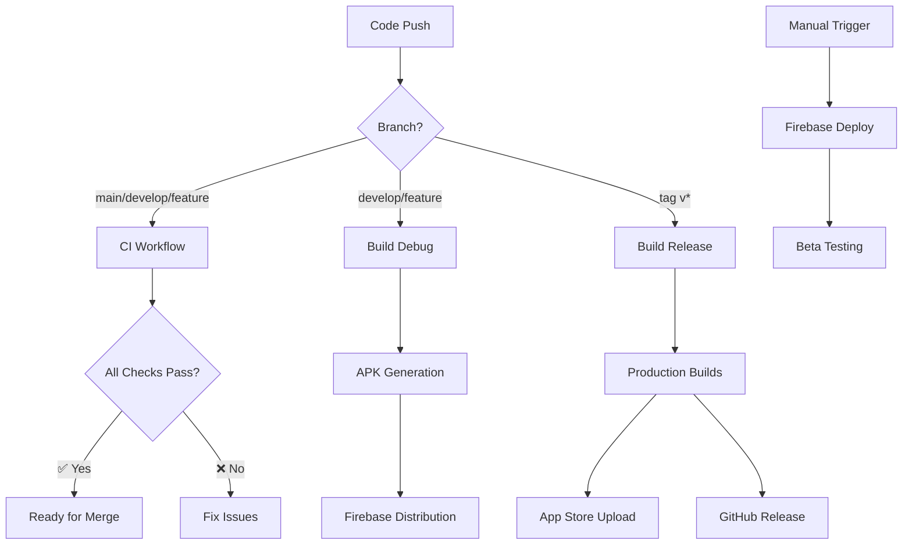

# 🚀 TrackFlow GitHub Actions Workflows Guide

Complete guide to TrackFlow's CI/CD pipelines, their purposes, usage, and store distribution setup.

## 📋 Table of Contents

- [Overview](#overview)
- [Workflow Architecture](#workflow-architecture)
- [1. CI Workflow](#1-ci-workflow---tests-y-análisis)
- [2. Build Debug Workflow](#2-build-debug-workflow)
- [3. Build Release Workflow](#3-build-release---production)
- [4. Firebase Deploy Workflow](#4-firebase-deploy-workflow)
- [Store Distribution Setup](#store-distribution-setup)
- [Secrets Configuration](#secrets-configuration)
- [Usage Examples](#usage-examples)
- [Troubleshooting](#troubleshooting)

---

## Overview

TrackFlow has 4 main GitHub Actions workflows that handle different stages of the development and deployment pipeline:

| Workflow | Purpose | Trigger | Output |
|----------|---------|---------|--------|
| **CI** | Code quality, tests, analysis | Push/PR | Quality gates |
| **Build Debug** | Development builds | Push to develop/feature | APK for testing |
| **Build Release** | Production builds | Tags/Manual | AAB/IPA for stores |
| **Firebase Deploy** | Beta distribution | Manual/develop | Firebase App Distribution |

---

## Workflow Architecture



---

## 1. CI Workflow - 🧪 Tests y Análisis

**File:** `.github/workflows/ci.yml`

### Purpose
Quality gates for all code changes - ensures code quality, runs tests, and validates builds.

### Triggers
- **Push** to: `main`, `develop`, `feature/*`, `fix/*`, `hotfix/*`, `production-ready-*`
- **Pull Requests** to: `main`, `develop`
- **Manual** via `workflow_dispatch`

### What It Does

#### 🧪 Unit Tests & Analysis
- ✅ Sets up Flutter 3.29.3 with Dart 3.7.2
- ✅ Installs dependencies (`flutter pub get`)
- ✅ Generates code (`build_runner`)
- ✅ Runs code analysis (`flutter analyze`)
- ✅ Executes unit tests (`flutter test`)
- ✅ Uploads coverage to Codecov
- ✅ Security scan with Trivy

#### 🔨 Build Verification
- ✅ Builds APK for all flavors (development, staging, production)
- ✅ Verifies builds are generated correctly
- ✅ Matrix strategy for parallel builds

#### 🎯 Integration Tests (PR only)
- ✅ Runs on macOS with Android emulator
- ✅ Executes integration tests
- ✅ Only runs for pull requests

### Usage

```bash
# Manual trigger
gh workflow run ci.yml --ref your-branch-name

# Watch progress
gh run list --limit 5
gh run watch [RUN_ID]
```

### Success Criteria
- ✅ All unit tests pass
- ✅ Code analysis has zero issues
- ✅ All flavors build successfully
- ✅ Security scan passes
- ✅ Integration tests pass (for PRs)

---

## 2. Build Debug Workflow

**File:** `.github/workflows/build-debug.yml`

### Purpose
Generates debug APKs for development and testing, with automatic Firebase App Distribution.

### Triggers
- **Push** to: `develop`, `feature/*`, `release/*`
- **Manual** via `workflow_dispatch` with flavor selection

### What It Does

#### 🤖 Android Debug Builds
- ✅ Builds debug APKs for selected flavors
- ✅ Default: `development` and `staging`
- ✅ Manual: Choose specific flavor
- ✅ Uploads to Firebase App Distribution
- ✅ Stores artifacts for 7 days

#### 🍎 iOS Debug Builds (Manual only)
- ✅ Builds iOS debug without code signing
- ✅ Only available via manual trigger
- ✅ Generates .app bundle for testing

#### 🔔 Notifications
- ✅ Slack notifications for success/failure
- ✅ Includes build details and download links

### Manual Trigger Options

```bash
# Trigger with specific flavor
gh workflow run build-debug.yml \
  --ref develop \
  -f flavor=development \
  -f upload_to_firebase=true

# Available flavors: development, staging
```

### Firebase App Distribution
- 📱 **Development**: Sent to `testers` group
- 📱 **Staging**: Sent to `testers` group
- 📱 **Release Notes**: Auto-generated with commit info
- 📱 **Retention**: 7 days

---

## 3. Build Release - 🚀 Production

**File:** `.github/workflows/build-release.yml`

### Purpose
Creates production-ready builds for app store distribution.

### Triggers
- **Push** tags matching `v*` (e.g., `v1.0.0`)
- **Manual** via `workflow_dispatch` with version input

### What It Does

#### 🏷️ Version Management
- ✅ Extracts version from git tag or manual input
- ✅ Updates `pubspec.yaml` with version+build number
- ✅ Uses timestamp for unique build numbers

#### 🤖 Android Release Build
- ✅ Builds signed App Bundle (.aab)
- ✅ Uses production keystore
- ✅ Ready for Google Play Store
- ✅ Optional auto-upload to Play Store

#### 🍎 iOS Release Build
- ✅ Builds signed IPA archive
- ✅ Uses distribution certificates
- ✅ Ready for App Store Connect
- ✅ Optional auto-upload to TestFlight

#### 🏷️ GitHub Release
- ✅ Creates GitHub release with artifacts
- ✅ Includes both Android and iOS builds
- ✅ Auto-generated release notes
- ✅ 30-day artifact retention

### Usage

```bash
# Via Git Tag (Recommended)
git tag v1.2.0
git push origin v1.2.0

# Manual Trigger
gh workflow run build-release.yml \
  -f version=1.2.0 \
  -f upload_to_stores=true
```

### Store Upload Options
- 🏪 **Google Play**: Internal testing track (configurable)
- 🍎 **App Store**: TestFlight for review
- ⚠️ **Manual Review**: Required before production release

---

## 4. Firebase Deploy Workflow

**File:** `.github/workflows/deploy-firebase.yml`

### Purpose
Distributes builds to beta testers and QA teams via Firebase App Distribution.

### Triggers
- **Push** to `develop` branch
- **Manual** via `workflow_dispatch` with customization

### Manual Options
- **Flavor**: `development`, `staging`
- **Release Notes**: Custom message
- **Tester Group**: `qa-team`, `beta-testers`, `internal-team`

### What It Does

#### 📱 Android Distribution
- ✅ Builds debug APK for selected flavor
- ✅ Uploads to Firebase App Distribution
- ✅ Sends to specified tester group
- ✅ Custom release notes

#### 🍎 iOS Distribution
- ✅ Builds iOS debug (manual only)
- ✅ No code signing required for testing
- ✅ Distributes via Firebase

### Usage

```bash
# Manual trigger with options
gh workflow run deploy-firebase.yml \
  --ref develop \
  -f flavor=staging \
  -f release_notes="New UI improvements and bug fixes" \
  -f testers_group=beta-testers
```

---

## Store Distribution Setup

To enable full store distribution, you need to configure secrets and certificates:

### 🤖 Google Play Store Setup

#### Required Secrets
```bash
# Android Signing
ANDROID_KEYSTORE_BASE64          # Base64 encoded keystore file
ANDROID_KEYSTORE_PASSWORD        # Keystore password
ANDROID_KEY_PASSWORD            # Key password
ANDROID_KEY_ALIAS               # Key alias

# Google Play API
GOOGLE_PLAY_SERVICE_ACCOUNT     # Service account JSON
```

#### Steps to Setup
1. **Create Release Keystore**:
```bash
keytool -genkey -v -keystore trackflow-release-key.keystore \
  -alias trackflow -keyalg RSA -keysize 2048 -validity 10000
```

2. **Encode Keystore**:
```bash
base64 -i trackflow-release-key.keystore | pbcopy
```

3. **Create Google Play Service Account**:
   - Go to Google Play Console → Setup → API access
   - Create service account with release management permissions
   - Download JSON key

4. **Add to GitHub Secrets**:
   - Repository Settings → Secrets → Actions
   - Add all required secrets

### 🍎 App Store Connect Setup

#### Required Secrets
```bash
# iOS Signing
IOS_CERTIFICATE_BASE64          # Distribution certificate (p12)
IOS_CERTIFICATE_PASSWORD        # Certificate password

# App Store Connect API
APPLE_ISSUER_ID                 # API issuer ID
APPLE_API_KEY_ID               # API key ID
APPLE_API_PRIVATE_KEY          # API private key
```

#### Steps to Setup
1. **Create Distribution Certificate**:
   - Apple Developer → Certificates → Distribution
   - Download and convert to p12

2. **Create API Key**:
   - App Store Connect → Users → Keys
   - Create key with App Manager role

3. **Encode Certificate**:
```bash
base64 -i DistributionCertificate.p12 | pbcopy
```

4. **Add to GitHub Secrets**

### 🔥 Firebase App Distribution

#### Required Secrets
```bash
FIREBASE_SERVICE_ACCOUNT        # Firebase service account JSON
FIREBASE_APP_ID_DEV            # Development app ID
FIREBASE_APP_ID_STAGING        # Staging app ID
```

#### Setup Steps
1. **Firebase Project Setup**:
   - Create Firebase project
   - Add Android/iOS apps
   - Enable App Distribution

2. **Service Account**:
   - Firebase Console → Project Settings → Service Accounts
   - Generate new private key

3. **Get App IDs**:
   - Firebase Console → Project Settings → General
   - Copy App IDs for each flavor

### 📢 Slack Notifications

#### Required Secret
```bash
SLACK_WEBHOOK_URL              # Slack webhook URL
```

#### Setup
1. Create Slack app with webhook
2. Add webhook URL to secrets
3. Notifications will be sent for build results

---

## Usage Examples

### Development Workflow

```bash
# 1. Create feature branch
git checkout -b feature/new-audio-player

# 2. Make changes and commit
git add .
git commit -m "feat: implement new audio player controls"

# 3. Push - triggers CI automatically
git push origin feature/new-audio-player

# 4. Create PR - triggers CI with integration tests
gh pr create --title "New Audio Player" --body "Implements new controls"

# 5. Merge to develop - triggers debug build
git checkout develop
git merge feature/new-audio-player
git push origin develop
```

### Release Workflow

```bash
# 1. Create release branch
git checkout -b release/v1.2.0

# 2. Update version and test
# Make final adjustments

# 3. Merge to main
git checkout main
git merge release/v1.2.0

# 4. Create release tag - triggers production build
git tag v1.2.0
git push origin v1.2.0

# 5. GitHub release is created automatically with store builds
```

### Testing Workflow

```bash
# 1. Manual debug build for specific testing
gh workflow run build-debug.yml \
  --ref feature/payment-integration \
  -f flavor=staging

# 2. Firebase distribution to QA team
gh workflow run deploy-firebase.yml \
  --ref develop \
  -f flavor=staging \
  -f testers_group=qa-team \
  -f release_notes="Payment integration ready for QA testing"

# 3. Monitor build progress
gh run watch [RUN_ID]
```

---

## Troubleshooting

### Common Issues

#### 1. Build Failures
```bash
# Check logs
gh run view [RUN_ID] --log

# Re-run failed jobs
gh run rerun [RUN_ID]
```

#### 2. Signing Issues (Android)
- Verify keystore is base64 encoded correctly
- Check keystore password and alias
- Ensure key.properties file is created

#### 3. iOS Signing Issues
- Verify p12 certificate is valid
- Check provisioning profile matches bundle ID
- Ensure API keys have correct permissions

#### 4. Firebase Distribution Failures
- Check Firebase service account permissions
- Verify app IDs match Firebase project
- Ensure testers group exists

### Monitoring

```bash
# List recent runs
gh run list --limit 10

# Watch specific workflow
gh run watch [RUN_ID]

# View workflow status
gh workflow view ci.yml
```

### Performance Optimization

#### Cache Strategy
- Flutter SDK cached for faster builds
- Pub dependencies cached
- Build artifacts cached between jobs

#### Matrix Builds
- Parallel flavor builds for speed
- Fail-fast disabled to see all results

---

## 🎯 Next Steps

### To Enable Full Store Distribution:

1. **Fix Unit Tests** (Current blocker)
   - 38 failing tests need to be resolved
   - CI must be green before store releases

2. **Configure Secrets** (Store distribution)
   - Add all required secrets for signing
   - Set up Google Play and App Store Connect APIs

3. **Test Release Process**
   - Create test release with `v0.1.0-beta`
   - Verify builds are generated correctly
   - Test store upload process

4. **Production Release**
   - Create `v1.0.0` tag
   - Automatic store distribution
   - Monitor release metrics

### Immediate Actions:
```bash
# 1. Fix failing unit tests
flutter test

# 2. Test manual release build
gh workflow run build-release.yml -f version=0.1.0-beta

# 3. Configure store secrets (see setup sections above)
```

Your CI/CD pipeline is **production-ready**! Once unit tests are fixed and store secrets are configured, you'll have fully automated app distribution. 🚀