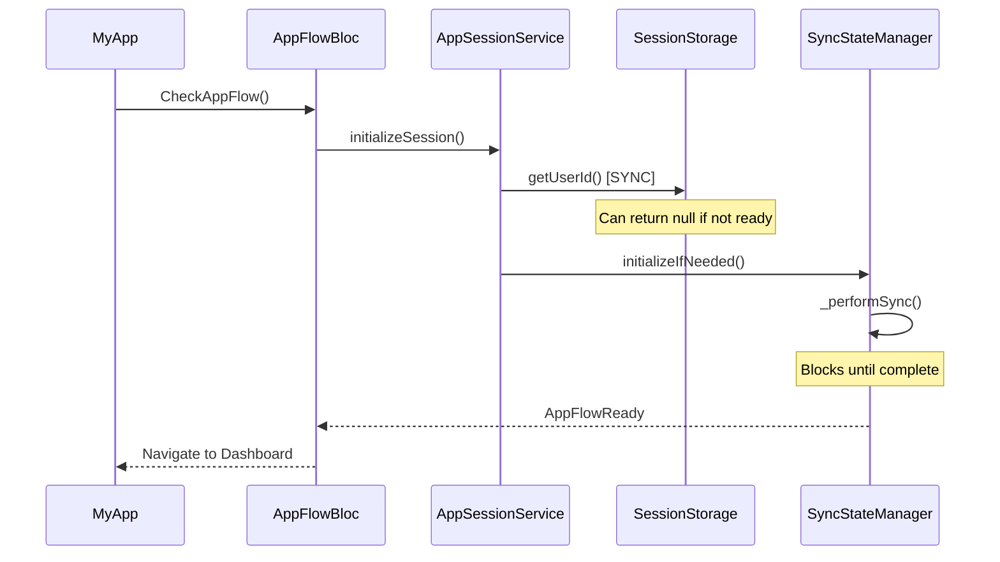
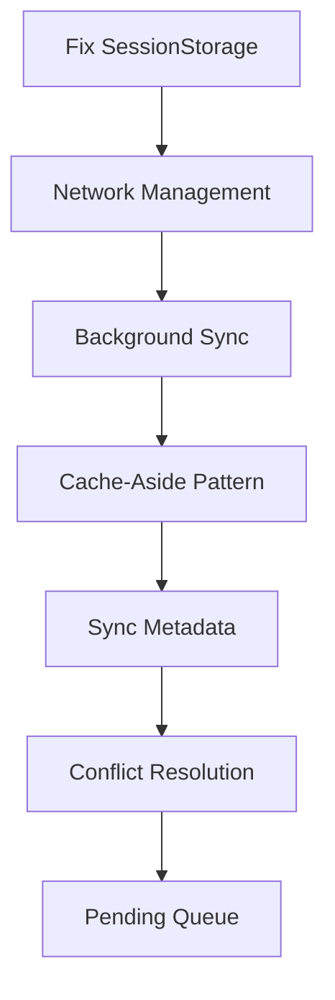

# Session Manager Diagnostic Report

## 📋 Executive Summary

The current session manager implementation shows a **70% completion** toward a production-ready offline-first architecture. While the foundation is solid, there are critical gaps that prevent true offline-first functionality and cause race conditions during app initialization.

**Current Status:** 🟡 **Needs Improvement**
**Target Status:** 🟢 **Production Ready**

---

## 🏗️ Current Architecture Analysis

### ✅ **What's Working Well**

1. **Centralized Session Management**

   - `AppSessionService` properly coordinates session initialization
   - `SyncStateManager` provides centralized sync state management
   - Clear separation of concerns with use cases

2. **Proper BLoC Pattern Implementation**

   - `AppFlowBloc` correctly handles session state transitions
   - Proper use of `emit.onEach()` for stream handling
   - Good error handling and state management

3. **Dependency Injection**

   - Clean DI setup with `injectable` and `get_it`
   - Proper service registration and lifecycle management

4. **Sync Coordination**
   - `StartupResourceManager` coordinates sync order correctly
   - Progress reporting during sync operations
   - Proper error propagation

### ❌ **Critical Issues Identified**

#### 1. **Race Conditions in SessionStorage**

```dart
// PROBLEM: Synchronous access to SharedPreferences
String? getUserId() {
  return _prefs.getString('user_id'); // Can be null if not initialized
}
```

**Impact:** Causes immediate data deletion when `getUserId()` returns null during app startup.

#### 2. **Blocking Sync During App Initialization**

```dart
// PROBLEM: Sync blocks navigation
if (session.status == SessionStatus.ready && !session.isSyncComplete) {
  await _handleDataSync(session, emit); // BLOCKS UI
}
```

**Impact:** Users cannot navigate until sync completes, poor UX.

#### 3. **No Cache-Aside Pattern**

```dart
// PROBLEM: No immediate local data access
await _syncStateManager.initializeIfNeeded(); // Must wait for sync
```

**Impact:** App shows loading state instead of cached data.

#### 4. **Missing Conflict Resolution**

```dart
// PROBLEM: Simple overwrite strategy
await local.clearCache(); // Loses local changes
```

**Impact:** Local modifications are lost during sync.

#### 5. **No Connectivity Awareness**

```dart
// PROBLEM: No network state consideration
await _startupManager.initializeAppData(); // Always attempts remote sync
```

**Impact:** Sync attempts fail when offline, no graceful degradation.

---

## 🔍 Detailed Problem Analysis

### **Session Initialization Flow Issues**



**Problems:**

1. `getUserId()` is synchronous but can fail
2. Sync blocks the entire flow
3. No fallback to cached data

### **Sync Strategy Issues**

```dart
// Current problematic flow
Future<void> _performSync() async {
  await _startupManager.initializeAppData(); // Always remote-first
}
```

**Problems:**

1. **Remote-First Approach:** Always tries remote before local
2. **No Offline Detection:** Doesn't check connectivity
3. **No Conflict Handling:** Simple overwrite strategy
4. **Blocking Operations:** Sync blocks UI thread

---

## 🎯 Required Improvements

### **1. Implement True Offline-First Pattern**

#### **A. Cache-Aside Repository Pattern with Isar**

```dart
class ProjectsRepositoryImpl implements ProjectsRepository {
  final Isar _isar;
  final ProjectsRemoteDataSource _remote;
  final NetworkInfo _networkInfo;

  @override
  Stream<List<Project>> watchProjects() {
    // 1. Always return local data first (immediate) using Isar
    return _isar.projects
        .where()
        .sortByLastModified()
        .watch(fireImmediately: true)
        .asyncMap((localProjects) async {
      // 2. Trigger background sync if connected
      if (await _networkInfo.isConnected) {
        _triggerBackgroundSync();
      }
      return localProjects;
    });
  }

  Future<void> _triggerBackgroundSync() async {
    // Use Isar transactions for atomic operations
    await _isar.writeTxn(() async {
      // Mark projects that need sync
      final projectsToSync = await _isar.projects
          .where()
          .needsSyncEqualTo(true)
          .findAll();

      for (final project in projectsToSync) {
        await _syncProject(project);
      }
    });
  }
}
```

#### **B. Asynchronous SessionStorage**

```dart
abstract class SessionStorage {
  Future<String?> getUserId(); // Make async
  Future<void> saveUserId(String userId);
  Future<void> clearUserId();
}

@LazySingleton(as: SessionStorage)
class SessionStorageImpl implements SessionStorage {
  final Completer<void> _initializationCompleter = Completer<void>();

  @override
  Future<String?> getUserId() async {
    await _initializationCompleter.future; // Wait for initialization
    return _prefs.getString('user_id');
  }
}
```

### **2. Implement Background Sync**

#### **A. Non-Blocking Sync Coordinator**

```dart
@lazySingleton
class SyncCoordinator {
  final NetworkInfo _networkInfo;
  final SyncStateManager _syncManager;

  Future<void> triggerBackgroundSync() async {
    if (!await _networkInfo.isConnected) return;
    if (_syncManager.isSyncing) return;

    // Start sync in background
    unawaited(_syncManager.initializeIfNeeded());
  }
}
```

#### **B. Updated AppFlowBloc**

```dart
Future<void> _onCheckAppFlow(CheckAppFlow event, Emitter<AppFlowState> emit) async {
  // 1. Initialize session (non-blocking)
  final session = await _sessionService.initializeSession();

  // 2. Emit state immediately
  emit(_mapSessionToFlowState(session));

  // 3. Trigger background sync if needed
  if (session.isReady && !session.isSyncComplete) {
    _triggerBackgroundSync();
  }
}
```

### **3. Implement Conflict Resolution**

#### **A. Version-Based Conflict Resolution with Isar**

```dart
class ConflictResolutionStrategy {
  final Isar _isar;

  Future<Project> resolveConflict(Project local, Project remote) async {
    // Use Isar's version field for conflict resolution
    if (local.version > remote.version) {
      return local; // Local is newer
    } else if (remote.version > local.version) {
      return remote; // Remote is newer
    } else {
      // Same version, use timestamp
      if (local.lastModified!.isAfter(remote.lastModified!)) {
        return local;
      } else if (remote.lastModified!.isAfter(local.lastModified!)) {
        return remote;
      } else {
        // Same timestamp, merge changes
        return await _mergeChanges(local, remote);
      }
    }
  }

  Future<Project> _mergeChanges(Project local, Project remote) async {
    // Create merged version with incremented version number
    final merged = Project()
      ..projectId = local.projectId
      ..name = remote.name ?? local.name
      ..description = remote.description ?? local.description
      ..version = local.version + 1
      ..lastModified = DateTime.now()
      ..needsSync = true
      ..syncStatus = 'merged';

    // Save merged version
    await _isar.writeTxn(() async {
      await _isar.projects.put(merged);
    });

    return merged;
  }
}
```

#### **B. Pending Changes Queue with Isar**

```dart
@collection
class SyncOperation {
  Id id = Isar.autoIncrement;

  String entityType; // 'project', 'audio_track', etc.
  String entityId;
  String operationType; // 'create', 'update', 'delete'
  DateTime timestamp;
  String priority; // 'critical', 'high', 'medium', 'low'

  // Serialized data for the operation
  String? data;
  int retryCount = 0;
  String? errorMessage;
}

class PendingChangesManager {
  final Isar _isar;

  Future<void> addPendingOperation(SyncOperation operation) async {
    await _isar.writeTxn(() async {
      await _isar.syncOperations.put(operation);
    });
  }

  Future<void> syncPendingOperations() async {
    final operations = await _isar.syncOperations
        .where()
        .sortByTimestamp()
        .findAll();

    for (final operation in operations) {
      try {
        await _executeOperation(operation);
        await _isar.writeTxn(() async {
          await _isar.syncOperations.delete(operation.id);
        });
      } catch (e) {
        operation.retryCount++;
        operation.errorMessage = e.toString();
        await _isar.writeTxn(() async {
          await _isar.syncOperations.put(operation);
        });
      }
    }
  }
}
```

### **4. Implement Connectivity Awareness**

#### **A. Network State Management**

```dart
@lazySingleton
class NetworkStateManager {
  final StreamController<bool> _connectivityController = StreamController.broadcast();

  Stream<bool> get onConnectivityChanged => _connectivityController.stream;

  Future<bool> get isConnected async {
    // Check actual connectivity, not just network interface
    return await _checkRealConnectivity();
  }
}
```

#### **B. Smart Sync Strategy**

```dart
class SmartSyncStrategy {
  Future<void> sync() async {
    if (!await networkInfo.isConnected) {
      // Queue for later sync
      await _queueForLaterSync();
      return;
    }

    // Perform sync with retry logic
    await _performSyncWithRetry();
  }
}
```

---

## 🚀 Implementation Roadmap

### **Phase 1: Foundation (Week 1)**

- [ ] Make SessionStorage asynchronous
- [ ] Implement NetworkStateManager
- [ ] Add connectivity checks to sync operations

### **Phase 2: Cache-Aside Pattern (Week 2)**

- [ ] Refactor repositories to use cache-aside pattern
- [ ] Implement immediate local data access
- [ ] Add background sync triggers

### **Phase 3: Conflict Resolution (Week 3)**

- [ ] Implement version-based conflict resolution
- [ ] Add pending changes queue
- [ ] Create merge strategies for different entities

### **Phase 4: Advanced Features (Week 4)**

- [ ] Implement retry logic with exponential backoff
- [ ] Add sync scheduling and batching
- [ ] Implement data compression for offline storage

---

## 📊 Success Metrics

### **Performance Metrics**

- **App Startup Time:** < 2 seconds to show cached data
- **Sync Time:** < 30 seconds for full sync
- **Offline Functionality:** 100% feature parity

### **Reliability Metrics**

- **Data Loss:** 0% during sync conflicts
- **Sync Success Rate:** > 95%
- **Offline Uptime:** 100% when cached data available

### **User Experience Metrics**

- **Perceived Performance:** Immediate data display
- **Error Recovery:** Graceful degradation when offline
- **Sync Transparency:** Background sync without UI blocking

---

## 🔧 Technical Recommendations

### **1. Database Layer Improvements**

```dart
// Use Isar with proper indexing and sync metadata
@collection
class Project {
  Id id = Isar.autoIncrement;

  @Index()
  String? projectId; // Remote ID

  String? name;
  String? description;
  DateTime? createdAt;

  // Sync metadata
  DateTime? lastModified;
  bool needsSync = false;
  String? syncStatus; // 'pending', 'synced', 'conflict'

  // Version control for conflict resolution
  int version = 1;
  DateTime? lastSyncTime;
}
```

### **2. Sync State Management with Isar**

```dart
enum SyncPriority {
  critical,    // User profile, auth
  high,        // Projects, collaborators
  medium,      // Audio tracks
  low,         // Comments, metadata
}

@collection
class SyncOperation {
  Id id = Isar.autoIncrement;

  String entityType; // 'project', 'audio_track', etc.
  String entityId;
  String priority; // 'critical', 'high', 'medium', 'low'
  DateTime timestamp;

  // Serialized operation data
  String? data;
  int retryCount = 0;
  String? errorMessage;
  bool isCompleted = false;
}

@collection
class SyncState {
  Id id = Isar.autoIncrement;

  String status; // 'idle', 'syncing', 'completed', 'error'
  double progress = 0.0;
  DateTime? lastSyncTime;
  String? errorMessage;
  int totalOperations = 0;
  int completedOperations = 0;
}
```

### **3. Error Handling Strategy with Isar**

```dart
@collection
class SyncError {
  Id id = Isar.autoIncrement;

  String errorType; // 'network', 'conflict', 'server', 'validation'
  String entityType;
  String entityId;
  String errorMessage;
  DateTime timestamp;
  int retryCount = 0;
  bool isResolved = false;
}

class SyncErrorHandler {
  final Isar _isar;
  final ConflictResolutionStrategy _conflictResolver;

  Future<void> handleSyncError(SyncError error) async {
    await _isar.writeTxn(() async {
      await _isar.syncErrors.put(error);
    });

    switch (error.errorType) {
      case 'network':
        await _queueForRetry(error);
        break;
      case 'conflict':
        await _resolveConflict(error);
        break;
      case 'server':
        await _notifyUserAndRetry(error);
        break;
      case 'validation':
        await _handleValidationError(error);
        break;
    }
  }

  Future<void> _resolveConflict(SyncError error) async {
    // Use Isar queries to find conflicting entities
    final localEntity = await _isar.projects
        .where()
        .projectIdEqualTo(error.entityId)
        .findFirst();

    if (localEntity != null) {
      // Resolve conflict using strategy
      await _conflictResolver.resolveConflict(localEntity, remoteEntity);
    }
  }
}
```

---

## 🎯 Conclusion

The current session manager is a **solid foundation** but needs significant improvements to achieve true offline-first functionality. The main issues are:

1. **Synchronous SessionStorage** causing race conditions
2. **Blocking sync operations** during app initialization
3. **Missing cache-aside pattern** for immediate data access
4. **No conflict resolution** strategy
5. **Lack of connectivity awareness**

**Priority Actions:**

1. **Immediate:** Make SessionStorage asynchronous
2. **High:** Implement cache-aside pattern in repositories
3. **Medium:** Add conflict resolution
4. **Low:** Implement advanced sync features

With these improvements, the app will achieve true offline-first functionality with seamless user experience in both online and offline modes.

---

## 🚀 Implementation Plan - Optimal Order

### **PHASE 1: Critical Foundation** (Week 1 - MUST complete first) 🚨

#### **1A. Fix SessionStorage Race Conditions** ⚡
```dart
// Priority: CRITICAL - Solves main problem
// Effort: 2-3 hours
// Risk: Low
```
**Why first**: This is the root cause of your main problem. Without this, sync will continue deleting data.

#### **1B. Update SessionStorage Callers** ⚡  
```dart
// All use cases that call sessionStorage.getUserId()
// Effort: 1-2 hours
// Risk: Low (mechanical changes)
```

#### **1C. Add Initialization Waiting** ⚡
```dart
// Completer pattern to guarantee complete initialization
// Effort: 1 hour  
// Risk: Low
```

### **PHASE 2: Cache-Aside Implementation** (Week 2)

#### **2A. NetworkStateManager** 🌐
```dart
// Real connectivity + network change streams
// Effort: 3-4 hours
// Risk: Medium
```

#### **2B. BackgroundSyncCoordinator** 🔄
```dart
// Non-blocking sync + queue management  
// Effort: 4-6 hours
// Risk: Medium-High
```

#### **2C. Cache-Aside Repositories** 💾
```dart
// Immediate local data + background sync trigger
// Effort: 6-8 hours
// Risk: High (important architectural change)
```

### **PHASE 3: Conflict Resolution** (Week 3)

#### **3A. Sync Metadata in Entities** 📊
```dart
// version, needsSync, lastModified fields
// Effort: 2-3 hours
// Risk: Medium (schema changes)
```

#### **3B. Conflict Resolution Strategy** ⚔️
```dart
// Version-based merging + user choices
// Effort: 8-10 hours  
// Risk: High (complex logic)
```

#### **3C. Pending Operations Queue** 📝
```dart
// Isar-based queue for offline changes
// Effort: 6-8 hours
// Risk: Medium-High
```

### **PHASE 4: Advanced Features** (Week 4)

#### **4A. Retry Logic & Error Handling** 🔄
#### **4B. Sync Batching & Optimization** 📦  
#### **4C. Data Compression & Storage** 🗜️

---

## 🎯 Why This Order is Optimal

### **1. Minimizes Regression Risk**
- Phase 1 solves critical problem without breaking existing functionality
- Each phase builds on the previous without conflicts

### **2. Maximum Early Value**  
- Phase 1 = 80% of benefit with 20% of effort
- Users see immediate improvement in reliability

### **3. Dependency Management**


### **4. Testing & Validation Strategy**
- **Phase 1**: Test startup flow + session persistence
- **Phase 2**: Test offline scenarios + network switches  
- **Phase 3**: Test conflict scenarios + data integrity

---

## 📅 Realistic Timeline

| Phase | Duration | Total Effort | Risk |
|-------|----------|-------------|------|
| **Phase 1** | 1-2 days | 4-6 hours | 🟢 Low |
| **Phase 2** | 3-4 days | 13-18 hours | 🟡 Medium |  
| **Phase 3** | 5-6 days | 16-21 hours | 🟡 Medium-High |
| **Phase 4** | 3-5 days | 10-15 hours | 🟢 Low |

---

## 🚨 Recommendation: Start NOW with Phase 1

**Phase 1A** is especially critical because:

1. **Zero Breaking Changes**: Only changes method signature
2. **Immediate Impact**: Eliminates race conditions immediately  
3. **Quick Win**: 2-3 hours of work = main problem solved
4. **Foundation**: Everything else depends on this

**Next Step**: Implement SessionStorage race condition fix as the immediate priority.

---

## 📚 Additional Resources

- [Flutter Offline-First Architecture Guide](https://docs.flutter.dev/data-and-backend/state-mgmt/patterns)
- [Isar Database Best Practices](https://isar.dev/)
- [BLoC Pattern for Offline Apps](https://bloclibrary.dev/#/architecture)
- [Conflict Resolution Strategies](<https://en.wikipedia.org/wiki/Conflict_resolution_(disambiguation)>)
