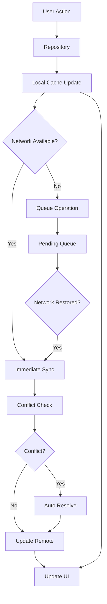

# 🔄 Offline-First Sync Architecture

This directory contains the core sync infrastructure that enables true offline-first functionality in TrackFlow.

## 📁 Directory Structure

```
lib/core/sync/
├── domain/
│   ├── entities/
│   │   ├── sync_metadata.dart        # Version control & sync status
│   │   └── sync_conflict.dart        # Conflict representation & resolution
│   └── services/
│       ├── conflict_resolution_service.dart  # Conflict detection & resolution
│       └── pending_operations_manager.dart   # Offline operations queue
├── data/
│   ├── models/
│   │   ├── sync_metadata_document.dart      # Isar embedded document
│   │   └── sync_operation_document.dart     # Isar collection for queue
│   └── repositories/
│       └── pending_operations_repository.dart  # CRUD for operations
└── background_sync_coordinator.dart  # Main sync coordinator
```

## 🏗️ Architecture Overview

### Core Components

1. **BackgroundSyncCoordinator**: Orchestrates all sync operations
2. **NetworkStateManager**: Manages network connectivity awareness
3. **ConflictResolutionService**: Handles data conflicts
4. **PendingOperationsManager**: Manages offline operations queue
5. **SyncMetadata**: Version control for all entities

### Data Flow



## 🚀 Usage Guide

### Setting Up Sync for New Entities

#### 1. Add Sync Metadata to Isar Document

```dart
@collection
class YourEntityDocument {
  // ... existing fields
  
  // Add sync metadata
  late SyncMetadataDocument syncMetadata;
  
  // Factory constructors
  factory YourEntityDocument.fromDTO(YourDTO dto, {SyncMetadataDocument? syncMeta}) {
    return YourEntityDocument()
      // ... map fields
      ..syncMetadata = syncMeta ?? SyncMetadataDocument.initial();
  }
  
  factory YourEntityDocument.fromRemoteDTO(YourDTO dto) {
    return YourEntityDocument()
      // ... map fields  
      ..syncMetadata = SyncMetadataDocument.fromRemote(
        version: dto.version ?? 1,
        lastModified: dto.updatedAt ?? dto.createdAt,
      );
  }
}
```

#### 2. Implement Cache-Aside Pattern in Repository

```dart
@LazySingleton(as: YourRepository)
class YourRepositoryImpl implements YourRepository {
  final YourRemoteDataSource _remoteDataSource;
  final YourLocalDataSource _localDataSource;
  final BackgroundSyncCoordinator _backgroundSyncCoordinator;

  @override
  Stream<Either<Failure, List<YourEntity>>> watchEntities() {
    return _localDataSource
        .watchAll()
        .asyncMap((entities) async {
          // 1. Return local data immediately
          final result = entities.map((e) => e.toDomain()).toList();
          
          // 2. Trigger background sync (non-blocking)
          _backgroundSyncCoordinator.triggerBackgroundSync(
            syncKey: 'your_entities',
          );
          
          return Right(result);
        });
  }

  @override
  Future<Either<Failure, YourEntity>> createEntity(YourEntity entity) async {
    try {
      final hasConnected = await _networkInfo.isConnected;
      
      if (hasConnected) {
        // Online: Create on remote and cache locally
        final result = await _remoteDataSource.create(entity.toDTO());
        return result.fold(
          (failure) => Left(failure),
          (createdDto) async {
            await _localDataSource.cache(createdDto);
            return Right(createdDto.toDomain());
          }
        );
      } else {
        // Offline: Cache locally with pending sync
        final dto = entity.toDTO();
        final cacheResult = await _localDataSource.cache(dto);
        
        // Add to pending operations
        await _addPendingOperation('create', entity.id, dto.toJson());
        
        return cacheResult.fold(
          (failure) => Left(failure),
          (unit) => Right(entity),
        );
      }
    } catch (e) {
      return Left(DatabaseFailure('Failed to create entity: $e'));
    }
  }
}
```

#### 3. Add Conflict Resolution

```dart
@lazySingleton  
class YourConflictResolutionService extends ConflictResolutionServiceImpl<YourEntity> {
  
  @override
  Future<YourEntity> _performMerge(SyncConflict<YourEntity> conflict) async {
    final local = conflict.localVersion;
    final remote = conflict.remoteVersion;
    
    // Entity-specific merge logic
    return YourEntity(
      id: local.id,
      name: conflict.localMetadata.lastModified.isAfter(conflict.remoteMetadata.lastModified)
          ? local.name 
          : remote.name,
      // ... merge other fields based on business logic
      updatedAt: [conflict.localMetadata.lastModified, conflict.remoteMetadata.lastModified]
          .reduce((a, b) => a.isAfter(b) ? a : b),
    );
  }
}
```

### Adding Pending Operations

```dart
// In repository methods
Future<void> _addPendingOperation(String operation, String entityId, Map<String, dynamic> data) async {
  final pendingOperations = getIt<PendingOperationsManager>();
  
  await pendingOperations.addOperation(
    entityType: 'your_entity_type',
    entityId: entityId,
    operationType: operation, // 'create', 'update', 'delete'
    priority: SyncPriority.medium,
    data: data,
  );
}
```

## 🔧 Configuration

### Add New Entity to Build Configuration

Update `build.yaml`:

```yaml
targets:
  $default:
    builders:
      isar_generator:
        generate_for:
          - "lib/your_feature/data/models/your_entity_document.dart"
```

### Register Services in DI

Services are automatically registered with `@lazySingleton` annotations, but ensure your new entity document schema is added to `app_module.dart`:

```dart
@preResolve
Future<Isar> get isar async {
  final dir = await getApplicationDocumentsDirectory();
  return await Isar.open([
    // ... existing schemas
    YourEntityDocumentSchema,
  ], directory: dir.path);
}
```

## 📊 Monitoring & Debugging

### Check Sync Status

```dart
// Get sync coordinator
final syncCoordinator = getIt<BackgroundSyncCoordinator>();

// Check if sync is in progress
final hasPendingSync = syncCoordinator.hasPendingSync;
final ongoingKeys = syncCoordinator.ongoingSyncKeys;

// Check pending operations
final pendingOps = getIt<PendingOperationsManager>();
final pendingCount = await pendingOps.getPendingOperationsCount();
final operations = pendingOps.watchPendingOperations();
```

### Network Status

```dart
final networkManager = getIt<NetworkStateManager>();

// Current status
final isConnected = await networkManager.isConnected;
final hasWifi = await networkManager.hasWifiConnection();
final hasGoodConnection = await networkManager.hasGoodConnection();

// Listen to changes
networkManager.onConnectivityChanged.listen((isConnected) {
  print('Network status changed: $isConnected');
});
```

## 🚨 Error Handling

### Sync Errors

Sync errors are automatically handled by the system:

1. **Network errors**: Operations queued for retry
2. **Conflicts**: Auto-resolved using configured strategies  
3. **Server errors**: Retried with exponential backoff
4. **Validation errors**: Logged and marked as failed

### Manual Conflict Resolution

For conflicts that can't be auto-resolved:

```dart
final conflictService = getIt<ConflictResolutionService>();

final conflict = await conflictService.detectConflict(
  entityType: 'project',
  entityId: 'project-123',
  localVersion: localProject,
  remoteVersion: remoteProject,
  localMetadata: localMetadata,
  remoteMetadata: remoteMetadata,
);

if (conflict != null && conflict.conflictType.requiresUserInput) {
  // Show conflict resolution UI to user
  final resolved = await showConflictResolutionDialog(conflict);
  
  final resolvedEntity = await conflictService.resolveConflict(
    conflict: conflict,
    strategy: ConflictResolutionStrategy.manual,
    // Pass user's resolution choice
  );
}
```

## 🎯 Best Practices

### Do's ✅

- Always return local data first in repositories
- Use background sync for all data fetching
- Add proper sync metadata to all entities
- Handle offline states gracefully in UI
- Use appropriate priorities for operations

### Don'ts ❌

- Don't block UI for sync operations
- Don't clear cache on sync failures
- Don't ignore conflict resolution
- Don't synchronously access session storage
- Don't make repositories remote-first

## 📈 Performance Tips

1. **Batch Operations**: Group related operations together
2. **Priority Management**: Use appropriate priorities for operations
3. **Cleanup**: Regularly clean completed operations
4. **Indexing**: Add indexes for frequently queried sync metadata
5. **Monitoring**: Watch pending operations count for performance insights

## 🔄 Migration Guide

If you're migrating existing repositories to use this sync system:

1. Add sync metadata to your Isar documents
2. Update repository to return local data first
3. Add background sync triggers  
4. Implement conflict resolution for your entity type
5. Test offline scenarios thoroughly
6. Update UI to handle offline states

This sync architecture ensures your app works seamlessly both online and offline, with automatic conflict resolution and zero data loss.