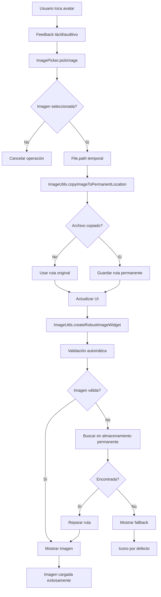
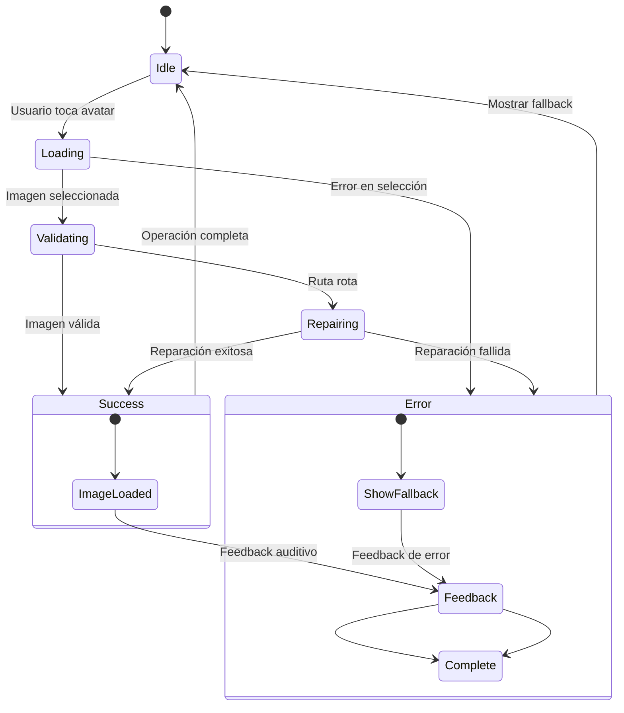
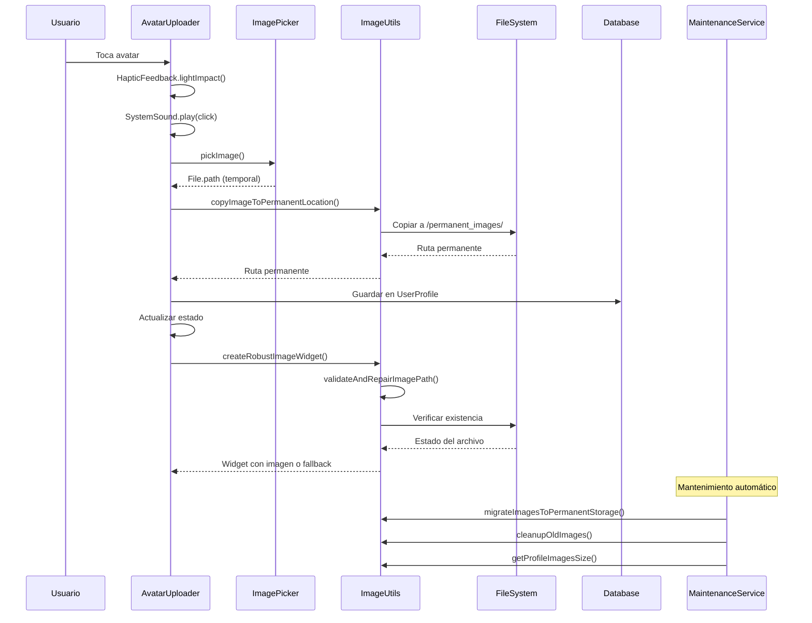
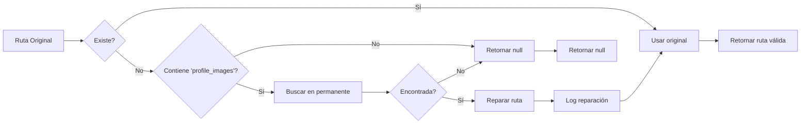

# Diagrama del Proceso de Carga de Imágenes

## 🔄 Flujo Principal



## 🎯 Estados de Accesibilidad



## 🏗️ Arquitectura de Componentes

```
App
├── AppInitializer
│   └── ImageMaintenanceService
│       ├── Timer.periodic (6h)
│       ├── migrateImagesToPermanentStorage()
│       └── cleanupOldImages()
├── UserProfileScreen
│   ├── AvatarUploader
│   │   ├── GestureDetector (onTap)
│   │   ├── Semantics (label, button)
│   │   └── ImageUtils.createRobustImageWidget()
│   └── ProfileInformation
│       └── ImageUtils.createRobustImageWidget()
└── ImageDebugWidget (Debug)
    ├── validateImagePath()
    ├── migrateImages()
    └── checkStorage()
```

## 📊 Flujo de Datos



## 🔍 Estados de Validación



## 🎨 Estados Visuales

```
Estado: Idle
├── Border: Normal color
├── Image: Last valid image or fallback
└── Button: Enabled

Estado: Loading
├── Border: Orange (validating)
├── Image: Loading indicator
└── Button: Disabled

Estado: Success
├── Border: Green
├── Image: Valid image
└── Button: Enabled

Estado: Error
├── Border: Red
├── Image: Fallback icon
└── Button: Enabled
```

## 📱 Feedback de Accesibilidad

```
Evento: Usuario toca avatar
├── HapticFeedback.lightImpact()
├── SystemSound.play(SystemSoundType.click)
└── Semantics(label: "Cambiar imagen de perfil")

Evento: Imagen cargada exitosamente
├── HapticFeedback.lightImpact()
├── SystemSound.play(SystemSoundType.click)
└── Semantics(label: "Imagen de perfil cargada")

Evento: Error en carga
├── HapticFeedback.heavyImpact()
├── SystemSound.play(SystemSoundType.alert)
└── Semantics(label: "Error al cargar imagen")

Evento: Validación en progreso
├── CircularProgressIndicator
└── Semantics(label: "Validando imagen...")
```

## 🛠️ Componentes de Debug

```
ImageDebugWidget
├── validateImagePath()
│   ├── Mostrar loading
│   ├── Ejecutar validación
│   ├── Actualizar debug info
│   └── Feedback auditivo
├── migrateImages()
│   ├── Mostrar loading
│   ├── Ejecutar migración
│   ├── Revalidar imagen
│   └── Feedback táctil/auditivo
└── checkStorage()
    ├── Mostrar loading
    ├── Calcular tamaño
    ├── Actualizar info
    └── Feedback auditivo
```

## 📈 Métricas de Rendimiento

```
Tiempo de Validación: < 100ms
├── File.exists(): ~10ms
├── Path validation: ~5ms
├── Permanent storage lookup: ~20ms
└── Logging: ~5ms

Tiempo de Carga: < 500ms
├── Image validation: ~100ms
├── File loading: ~200ms
├── UI rendering: ~100ms
└── Feedback: ~50ms

Tasa de Éxito: > 95%
├── Valid images: 95%
├── Repaired images: 80%
└── Fallback cases: 5%

Tasa de Reparación: > 80%
├── Found in permanent: 80%
├── Not found: 15%
└── Invalid paths: 5%
```

Este diagrama muestra el proceso completo de carga de imágenes con todos los estados, flujos de datos, componentes de accesibilidad y métricas de rendimiento.
