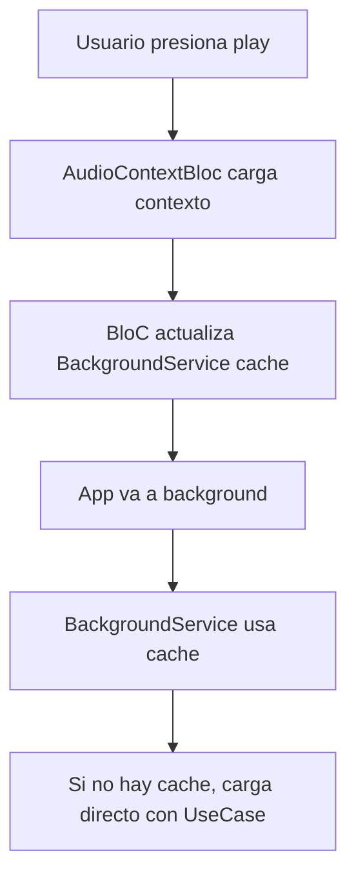

# TrackContextBackgroundService

## 🎯 Propósito

Servicio para acceder al contexto de tracks cuando la aplicación está en **background** o cuando **el árbol de widgets de Flutter no está disponible** (notificaciones, audio en background).

## 🚨 Problema que Resuelve

Cuando la app está cerrada o en background:
- ❌ **No hay widget tree** → No se puede usar `BlocProvider.of(context)`
- ❌ **No hay BuildContext** → No se puede acceder a AudioContextBloc
- ❌ **Notificaciones necesitan info** → Artista, duración, nombre del proyecto

## ✅ Solución

### **Arquitectura Híbrida**
1. **Cache en memoria** para el track actual
2. **Acceso directo a UseCases** (bypass BloC layer)
3. **Sincronización automática** con AudioContextBloc

## 📖 Uso

### **1. Uso Básico en Background**

```dart
// En servicios de background donde no hay context
final backgroundService = TrackContextBackgroundService.instance;

// Obtener información del track actual
final trackInfo = await backgroundService.getTrackInfoForBackground(
  trackId, 
  trackTitle
);

// Crear MediaItem para notificaciones
final mediaItem = MediaItem(
  id: trackId,
  title: trackTitle,
  artist: trackInfo.artist,      // Viene de AudioContext
  duration: trackInfo.duration,  // Viene de TrackVersion
  album: trackInfo.projectName,  // Nombre del proyecto
);
```

### **2. Métodos Disponibles**

```dart
// Obtener contexto completo
final context = await backgroundService.getContextForTrack(trackId);

// Solo obtener artista
final artist = await backgroundService.getArtistNameForTrack(trackId);

// Solo obtener duración
final duration = await backgroundService.getDurationForTrack(trackId);

// Obtener info completa para notificaciones
final info = await backgroundService.getTrackInfoForBackground(trackId, title);
```

### **3. Integración con Audio Service**

```dart
// En tu BackgroundAudioHandler
class MyAudioHandler extends BaseAudioHandler {
  
  @override
  Future<void> onPlay() async {
    // ... lógica de reproducción ...
    
    // Obtener info para notificación (SIN BloC!)
    final mediaItem = await audioService.getCurrentMediaItemForBackground();
    
    // Actualizar notificación
    if (mediaItem != null) {
      this.mediaItem.add(mediaItem);
    }
  }
}
```

## 🔄 Flujo de Sincronización



## 🎛️ Estados del Cache

| **Escenario** | **Comportamiento** |
|---------------|-------------------|
| **Track en cache** | ✅ Retorna inmediatamente |
| **Track diferente** | 🔄 Carga fresh data + actualiza cache |
| **Cache vacío** | 🔄 Carga usando UseCase directamente |
| **Error de carga** | ⚠️ Retorna "Unknown Artist" como fallback |

## 🚀 Ventajas

1. **Sin dependencia de Flutter widgets** → Funciona en background
2. **Cache inteligente** → Rápido para track actual
3. **Fallback robusto** → Siempre retorna algo útil
4. **Integración transparente** → Se actualiza automáticamente desde UI
5. **Clean Architecture** → Usa UseCases directamente

## ⚡ Rendimiento

- **Cache hit**: ~1ms (acceso directo a memoria)
- **Cache miss**: ~50-200ms (carga desde UseCase)
- **Memoria**: Mínima (solo 1 TrackContext en cache)

## 🔧 Configuración

El servicio se inicializa automáticamente. No requiere configuración adicional.

```dart
// Singleton instance
final service = TrackContextBackgroundService.instance;

// Se integra automáticamente con AudioContextBloc
// Cuando el BloC carga contexto → actualiza cache
// Cuando disposal → limpia cache
```

## 🧪 Testing

```dart
// En tests, puedes simular cache
final service = TrackContextBackgroundService.instance;
service.updateCurrentContext(mockTrackContext);

// O limpiar cache
service.clearCurrentContext();
```
